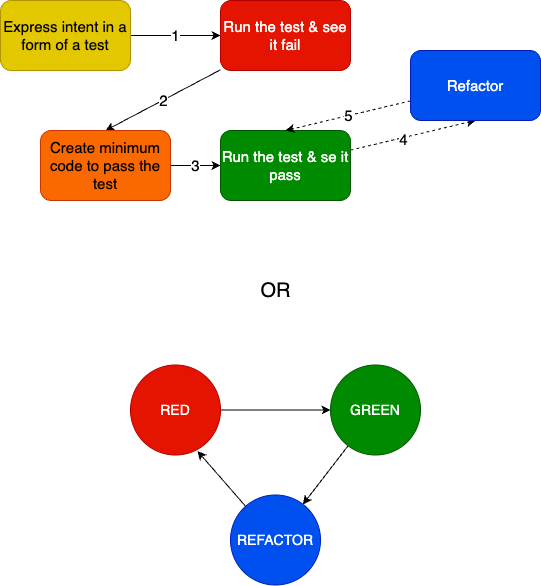

# Testing

How much testing is enough?

## Unit Testing

## Manual Testing

## Behaviour-Driven Development

## Test-Driven Development
### What is it TDD?
It’s about driving development from test, implementing a better code design and less about testing (seriously). You organise all your development activities around the need to verify what it is you're developing and so testing becomes the tool that does the verification of code implementation 'correctness'.

TDD encourages a more iterative approach to software development - moving in small steps, one feature/unit/component at a time. 

### TDD workflow


#### Steps:

1. Express your intent in the form of a test. This is a mini specification in the form of a test. Think of it as writing a test for the code that does not exist. A good prompt could be to follow either the 'Given, when, then' or the 'Arrange, Action, Assert' framework. For example, if you want to test a feature that lets an authenticated user create posts, you could have something like the below:
```php
...
//Given we have a user
//Arrange
$user = UserFactory::new()->create();

//And this user is authenticated
//Arrange
$this->signIn($user);
$this->assertTrue($user->isAuthenticated());

//When the user requests to create a new post
//Act
$this->post(route('posts.store'), ['title' => 'Test', 'body' => 'Lorem ipsum...'])->assertSessionHasNoErrors();

//Then the post is successfully created
//Assert
$this->assertDatabaseHas('posts', 1);

//And the user is the author of this post
//Assert
$post = Post::first();
$this->assertEqual($post->author, $user);
```
Here you simply express the steps you think are needed to be taken to create a post as an authenticated user. In other words, you are writing the code you believe the user would have taken (the test becomes a specification of this feature). 

2. Run the test and see it fail. Of course it’s going to fail because you have not written the code that implements this test (specification). This is a useful feedback, it tells you step by step what the issues are and prompts you to sort them one by one. Using the example above, the test execution would most likely inform you of the following:

```
Exception: Route 'posts.store' does not exist.
/// assuming that the User and its factor are already in place
```
3. Create a minimum code to pass the test. You know now that you need to focus on creating this `posts.store` route which can handle accepting a `title` and `body` inputs as well as call a relevant controller or service method to a post, etc.

4. Run the test again. Having implemented the route, you run the test again and it will show another error. This is good as you are making progress and moving closer to implementing the test specification (feature). You then make another code implementation to address the next error, run the test, repeat this process until all the test errors are resolved and the test passes. 

The important bit here is that you got to the stable state of your feature where the test passes. Now you can use this as a 'defence' line to then start refactoring (improving) your code and/or test. This is now a tested, bear minimum code implementation that meets the feature specification. There are two important benefits here that are often overlooked: **speed** (minimum time spent implementing the feature) and **quality** (test is a proof that the feature works as specified).

5. Refactor. Now that you are in a stable, passing test state you can focus on refactoring both the test and the code implementation for quality. Quality here could mean many things: readability, generality or reusability of functions, classes or making the test and implementation simpler. You are more confident in doing any type of refactoring here as you have a passing test to fallback on. 

#### Another interpretation of the TDD workflow   
Red. Green. Refactor.
- ***Red*** - Write a test and see it fail.
- ***Green*** - Write code and see the test pass.
- ***Refactor*** - Make the test and/or code better.

### Why use TDD?
- Better code design - start with the test and design the external view of the feature implementation. This is achievable because when you write the test for the code that does not exist - you can think of the steps from the point of the consumer of the feature (end user) and focus on the steps they need to take to get to the desired result. This is quite the opposite from the situation where you implement the code as a feature producer (jumping straight to the solution). Since you do not have the implemented feature code, all you do is designing how you expect end users to use you code. Unless you are an idiot, all you want to do is to make your code easier to understand and use. If the test setup looks complex and convoluted - you can make it better. Little time is wasted here to make the test better as there is no actual implementation yet - you are designing via a test the code implementation you wish you had for your end user to use. 

- Improves code quality - better designed code + fully tested feature implementation raises the overall quality of the software. You design better tests which make you focus on designing a well tested code and the well tested code has the same properties software engineers value in the high quality software. Also, the by-product of TDD is a test suite that can be run again and gain. This also gives you confidence to refactor and continually iterate/improve your code base, raising the overall quality of the system. 

- Helps understand the problem - this is a stumbling block for many teams starting with TDD. Some are struggling to think of their system without thinking about the solution. But how can you come up with a solution if you do not understand the problem. TDD focuses on the problem by forcing you to come up with a design of the steps that need to be taken by the end user expressed in a form of a test. There are complex situations where it is not obvious what the steps should be taken when writing tests. Part of the trick in TDD is to work incrementally, in small steps. Those complex situations need to be broken down and the design of the individual broken pieces tackled in self-contained, independent, incremental test cases. 
A note to remember with TDD, a good TDD test expresses expected outcomes, not specific solutions.

- Faster delivery - quality matters if you want to move fast. If you want to create a better software you need to move faster, to move faster you need to create better software. The quality and speed are linked. There is no trade-off between speed and quality. Surely higher quality means more time spent on planning, figuring out the best design, writing tests, etc. That’s true, but the contrast to that is cutting corners by omitting some or all of the above mentioned steps and going straight to implementation stage and face the risk of re-work. Any re-work, bug chasing, troubleshooting, tech debt are costly. This is the time taken away from the team who could have been working on new features or services delivering value to the clients. Quality is a long term benefit that allows engineering teams to move at a faster and sustainable pace. ***Time spent doing a good job is an investment not a cost.***  

### When to test?
Always.

### TDD learning resources and credits
- Code Katas for practicing TDD with [cyber-dojo](https://beta.cyber-dojo.org/creator/home) 

- [TDD - what? why? and how?, Continuous Delivery](https://www.youtube.com/watch?v=llaUBH5oayw)

- [How to build quality software fast, Continuous Delivery](https://www.youtube.com/watch?v=ZmgbjaRfp_Q)

- [Why hasn’t TDD taken over the world?, Continuous Delivery](https://www.youtube.com/watch?v=XsbMNWW-hdY)

## Mocking

## Performance Testing

## Mutation Testing

## Test coverage